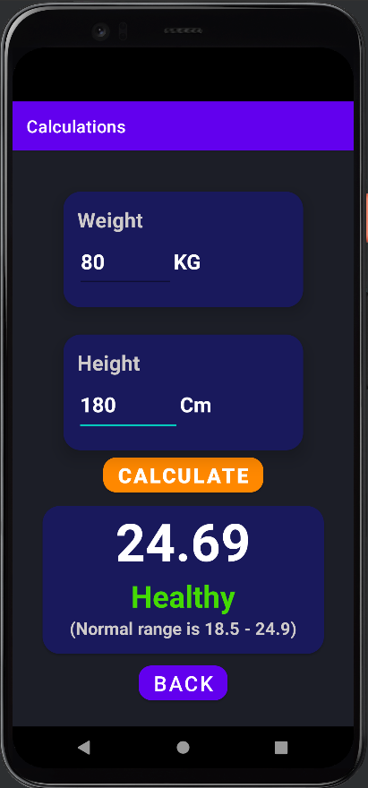

# Pikku-projekteja

Tässä repossa minulla on pieniä projekteja, joita olen tehnyt kurssilla ja vapaa-ajalla. Algorithms.java tiedostossa on erilaisia algoritemja mm. sorttausalgoritmeja. Datastructures.java tiedostossa on itse tehty pino, jono ja linkitetty lista. Laskin1 kansiossa on laskin, jossa on graafinen käyttöliittymä, jonka tein ohjelmointi 2 kurssilla. Calculator 2.0 on tehty javalla käyttäen android studioita. Tässä olen parannellut käyttöliittymmää pääosin ja tein siitä visuaalisesti hienomman.

Olen tehnyt myös ristinolla pelin, jossa on perus toiminnallisuus ja tämä on myöskin tehty android studiolla käyttäen javaa. Olen näiden android projektien ohessa harjoitellut Kotlinia ja minulla on isompi projekti tulossa käyttäen Kotlinia.

